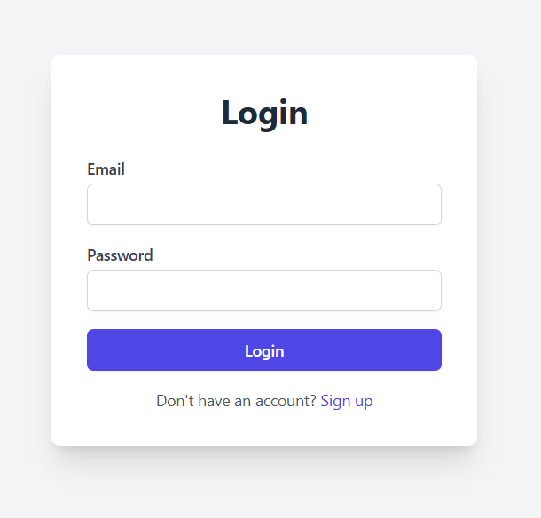
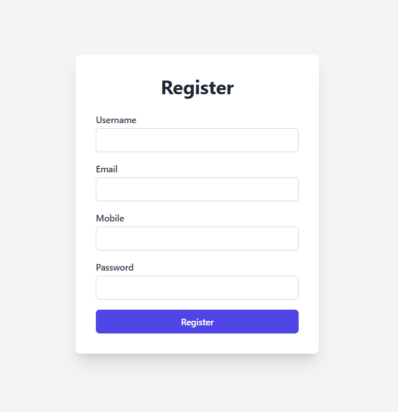
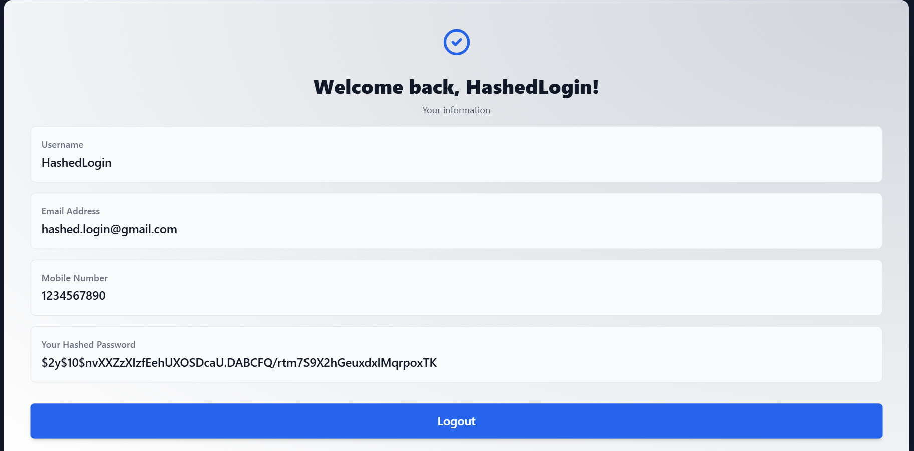

# Hashed Login System

A simple PHP-based login and registration system using hashed passwords and a MySQL database. The project demonstrates secure user authentication and session management with a modern Tailwind CSS UI.

# Team Members
TeamSN : 10

| Student ID  | Name              |
|-------------|-------------------|
| 221015051   | Selim Sheikh      |
| 221015056   | Fahim Anzam Dip   |
| 221015063   | Imran Hossain Sohag |

## Features
- User registration with password hashing (`password_hash`)
- User login with password verification (`password_verify`)
- Secure session management
- User dashboard displaying profile info
- Logout functionality
- Responsive UI with Tailwind CSS
- MySQL database integration
- Custom SHA-512 implementation

## File Structure
- `index.php` — Welcome page with links to Register and Login
- `register.php` — User registration form and logic
- `login.php` — User login form and logic
- `dashboard.php` — Protected user dashboard (requires login)
- `logout.php` — Ends session and redirects to login
- `db.php` — Database connection settings
- `sha512.php` — Custom SHA-512 hash implementation (not used for password storage)

## Setup Instructions
1. **Clone the repository**
2. **Create the MySQL database**
   - Database name: `cyber_project`
   - Table: `users`
   - Example SQL:
     ```sql
     CREATE TABLE users (
       id INT AUTO_INCREMENT PRIMARY KEY,
       username VARCHAR(255) NOT NULL,
       email VARCHAR(255) NOT NULL UNIQUE,
       mobile VARCHAR(20) NOT NULL,
       password VARCHAR(255) NOT NULL
     );
     ```
3. **Configure database connection**
   - Edit `db.php` if needed to match your MySQL credentials.
4. **Run the project**
   - Place files in your web server directory (e.g., `htdocs` for XAMPP)
   - Access `index.php` in your browser

## Security Notes
- Passwords are securely hashed using PHP's `password_hash` and verified with `password_verify`.
- Sessions are used to protect dashboard access.
- The custom SHA-512 implementation in `sha512.php` is for educational purposes only and is **not** used for password storage.
- Always use HTTPS in production.

## Requirements
- PHP 8.1+
- MySQL
- Tailwind CSS (via CDN)
- GMP PHP extension (only for `sha512.php`)

## Screenshots



